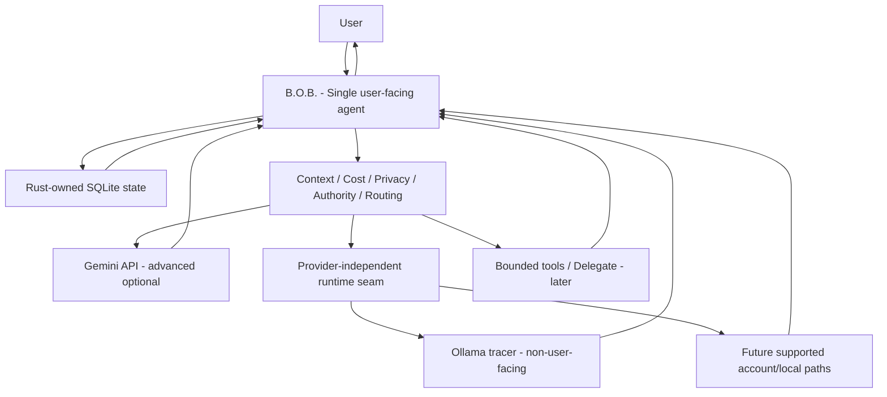

<div align="center">

# B.O.B.

### Better Organized Brain

**One agent. Less friction. The right intelligence when it matters.**

[](LICENSE)


A local-first, ADHD-friendly personal AI workbench that keeps tasks, plans, context, preferences, and continuity under one B.O.B.-owned surface while inference runtimes and host harnesses remain replaceable capabilities behind the scenes.

> **B.O.B. is the agent. Models, runtimes, provider APIs, harnesses, and tools are capabilities.**

</div>


> [!IMPORTANT]
> **Current status: Alpha Product.** B.O.B. is an active alpha desktop application, not a planning-only prototype. The core local-first product is implemented on `master`: Tauri 2 + Rust, Rust-owned SQLite state, Today/Inbox/Chat/Settings, deterministic planning, Assist/proposal validation, preview-before-apply, backup/restore/export, accessibility preferences, protected credentials, provider-independent runtime policy, an advanced optional Gemini API adapter, a non-user-facing Ollama tracer, reproducible Windows packaging, and hosted rendered diagnostics. The architecture now also includes an accepted portable-host contract and a bounded DeepSeek Harness tracer over the same deterministic planning semantics. The remaining desktop work is **alpha release qualification**, specifically native Windows startup-recovery acceptance, native NSIS install/relaunch/uninstall acceptance, and a final convergence audit. Those gates determine release evidence and readiness; they do not move the product back to pre-alpha. The retired Electron/Ollama prototype is historical only.

## Why B.O.B. exists

AI products are capable, but fragmented. Different providers bring different models, sessions, billing systems, permissions, and interfaces. Ordinary productivity tools preserve tasks but usually lack a coherent reasoning layer. Generic AI chat can reason well but does not own durable personal planning and executive-function structure.

B.O.B. sits between those worlds.

The user talks to **B.O.B.** B.O.B. owns the work, continuity, deterministic services, state, and policy. Inference runtimes and supported hosts can change without turning the product into a roster of competing agents or moving canonical state into a provider or harness session.

The user should not need an architecture diagram in their head to get through Tuesday.

## Product principles

> **Only the things that matter should compete for attention.**

- **One user-facing agent.** B.O.B. remains the identity regardless of which inference capability or supported host is used.
- **Local-first canonical state.** Tasks, plans, preferences, continuity, and policy remain B.O.B.-owned.
- **Useful without inference.** Capture, task lifecycle, planning, persistence, and recovery remain available when no model is allowed or available.
- **Preview before important changes.** Model output is untrusted until B.O.B. validates proposed application actions.
- **Provider independence.** No provider is allowed to become B.O.B.'s architectural landlord.
- **Host portability.** The Tauri application is the B.O.B. Desktop Host, not the permanent container for every B.O.B. semantic capability.
- **Not a B.O.T.** B.O.B. must not collapse into a **Bag of Tools** where capability aggregation substitutes for identity, state, continuity, authority, policy, and coherent user experience.
- **No surprise billing.** Authentication does not imply billing class; unknown cost fails closed; materially different providers or paid paths are never selected silently.
- **Low cognitive load.** The next useful move should be obvious without exposing the whole system at once.

See [`docs/PRODUCT.md`](docs/PRODUCT.md), [`docs/ARCHITECTURE.md`](docs/ARCHITECTURE.md), and [`docs/DESIGN.md`](docs/DESIGN.md).

## Four primary surfaces

| Surface | Job | Deliberate constraint |
| --- | --- | --- |
| **Today** | Focus, next action, daily planning, quick capture, replanning | Does not become a giant backlog dashboard |
| **Inbox** | Hold unprocessed tasks, ideas, notes, reminders, and brain dumps | Capture first, classify later |
| **B.O.B. Chat** | Explain, organize, break down, reorient, and propose | Provider/runtime complexity stays secondary |
| **Settings** | Accessibility, data/continuity, connected-intelligence configuration, privacy/cost controls | Internal governance and fake future-provider controls stay out |

The landed normal-mode experience is intentionally calm: one dominant purpose per screen, progressive disclosure for secondary detail, conditional space for empty content, and coherent density without relying on reduced-information mode to rescue a cluttered default.

## Architecture in one picture



The desktop host is Tauri 2 with a Rust privileged core and framework-free TypeScript/Vite frontend. The frontend does not receive unrestricted database, filesystem, shell, process, or credential access.

B.O.B. also has an accepted host-portability boundary. The Tauri application is the **B.O.B. Desktop Host**; RFC-0004 defines alternate first-party hosts, and the first bounded tracer adapts DeepSeek Harness to the same portable deterministic planning semantics. **DeepSeek is a host, not a provider, semantic owner, or peer agent.**

### Core architecture commitments

| Concern | Current authority |
| --- | --- |
| User-facing identity | **B.O.B. only** |
| Desktop shell | Tauri 2 |
| Privileged application core | Rust |
| Frontend | Framework-free TypeScript + Vite unless later justified |
| Canonical ordinary state | Rust-owned SQLite |
| Secret storage | OS-backed secret store; Windows Credential Manager on the Windows-first path |
| Default authority | Assist: reason, organize, and propose |
| Important state changes | Validate + preview before apply |
| Inference availability | Optional for deterministic task/planning behavior |
| Billing behavior | Known cost class required; no silent paid/different fallback |
| Provider architecture | Replaceable adapters behind B.O.B.-owned routing/policy |
| Portable capabilities | ADR-0006 + Accepted RFC-0004; first deterministic planning/DeepSeek host tracer implemented |
| Alternate-host state | Stateless tracer only; stateful hosted B.O.B. requires a separate accepted ownership/synchronization contract |
| Richer governed memory | Future explicit integration boundary; prefer reuse of `MythologIQ-Labs-LLC/agent-memory` semantics |

## What is implemented on `master`

The revived application now includes:

- Tauri 2 + Rust desktop foundation;
- Rust-owned SQLite canonical state and monotonic migrations;
- managed backup/restore plus portable non-secret export;
- Today, Inbox, B.O.B. Chat, and Settings surfaces;
- deterministic task lifecycle, planning, replanning, and restart handoff;
- B.O.B. Assist and typed proposal validation;
- preview-before-apply enforcement for important state changes;
- persisted accessibility preferences;
- protected credential handling through the OS secret-store boundary;
- advanced optional context-bearing Gemini API capability under accepted privacy/cost policy;
- provider-independent runtime/auth/billing/locality policy;
- a bounded non-user-facing Ollama tracer behind that runtime contract;
- a portable deterministic planning core plus bounded stdio capability host;
- a stateless DeepSeek Harness host tracer targeting the explicitly documented developer-preview compatibility point;
- locked desktop npm/Cargo dependency state and Windows NSIS package build path;
- hosted frontend, Windows Rust, rendered-UI, portable-core, capability-host, and protocol-edge diagnostics;
- converged calm Settings, Today, Inbox, and Chat presentation.

This is a substantive executable **Alpha Product**. Native desktop alpha release qualification is not complete yet. The DeepSeek integration remains a bounded tracer, not a claim of production-ready stateful hosted B.O.B.

## Current alpha qualification frontier

The active desktop frontier remains intentionally narrow:

1. **Startup recovery: issue #85 / draft PR #103.** The fail-closed recovery surface is implemented and hosted frontend/Rust/rendered evidence is green. It still requires native Windows 11 x64 corrupt-state, managed-backup preview, restart, filesystem-boundary, and accessibility evidence.
2. **Windows NSIS acceptance: issue #84 / draft PR #115.** Reproducible packaging is implemented. The remaining work is native Windows default-path install, launch, state survival across relaunch, executable/icon identity, uninstall, stopped-process, and retained-user-data evidence.
3. **Alpha convergence audit: Wayfinder #30.** After #103 and #84 receive truthful terminal dispositions, re-check the full alpha qualification contract before describing the integrated desktop build as native-qualified for release.
4. **Then promote one already-authorized inference path with native evidence.** Do not widen the provider surface merely because the queue becomes cleaner.

Issue #118 is a scoped owner-authorized exception that permits the disjoint portable-host tracer to advance without weakening or claiming satisfaction of these native gates.

Passing hosted CI is necessary regression evidence where relevant. It is not a substitute for the native Windows behavior required by these gates.

## Provider-independent inference

Gemini Developer API Free proved the inference, credential, privacy, billing, and failure-policy seams. It remains an **advanced optional adapter**, not B.O.B.'s permanent identity or universal onboarding model.

The accepted provider-independent direction is:

1. allow explicit user selection when supported;
2. classify billing independently from authentication;
3. prefer allowed `free`, already-included `subscription`, or intentionally `local` paths according to active product policy;
4. keep separately metered inference disabled unless explicitly enabled;
5. never silently switch provider/model when cost, privacy, locality, or user intent materially changes;
6. keep deterministic B.O.B. useful with no inference configured.

RFC-0002 defines the provider-independent runtime contract. Wayfinder #79 owns the provider-independence destination. The landed Ollama tracer proves the seam without making Ollama mandatory. The B.O.B.-owned local runtime direction is accepted, but a normal user-facing local-runtime path has not yet been promoted as an alpha requirement.

### Current Gemini API boundary

The existing Gemini API capability is subject to its accepted professional/business-use, unpaid-service data-use, sensitive-data, and billing-class conditions. Declining that boundary leaves deterministic B.O.B. usable.

See [`docs/governance/AI_COST_AND_PROVIDER_POLICY.md`](docs/governance/AI_COST_AND_PROVIDER_POLICY.md).

## ADHD-friendly by interaction design

B.O.B. does not diagnose ADHD, infer neurological traits, or score neurodivergence. It reduces executive-function friction through interaction design:

- capture before categorization;
- one obvious next action;
- small realistic daily focus;
- cheap replanning after disruption;
- progressive disclosure;
- interruption recovery and durable handoff;
- easy deferral without losing work;
- direct language and short decision sets;
- accessible typography, contrast, motion, density, keyboard use, and focus states;
- no guilt mechanics or disguised productivity scoring.

See [`docs/prd/PRD-0002-adhd-friendly-daily-planning.md`](docs/prd/PRD-0002-adhd-friendly-daily-planning.md).

## State, recovery, and privacy

B.O.B. is local-first, not local-only.

Canonical ordinary desktop state remains in a Rust-owned local SQLite database. Logical changes are transactional; schema migrations are monotonic and fail closed; backups/restores use SQLite-consistent snapshots; portable export excludes secrets; credentials remain outside SQLite in the OS secret store.

The active recovery work preserves corrupt/original canonical state and provides a restricted user-reachable recovery surface rather than silently resetting user data. Native Windows acceptance for that lifecycle is still required before desktop alpha release qualification is complete.

The first DeepSeek host tracer is intentionally stateless. It receives only planning-relevant fields and creates no second canonical B.O.B. database. A future stateful alternate host must explicitly resolve namespace, synchronization, migration, recovery, deletion/export, credential separation, and canonical ownership before implementation.

Remote inference receives only bounded context intentionally. Credentials must not appear in frontend state, logs, prompts, screenshots, fixtures, ordinary application data, or an alternate-host session by implication. Model/runtime output is untrusted until validated.

Cloud sync, generalized RAG, ambient autonomous execution, and broad plugin infrastructure are not part of the accepted current product boundary.

## Assist and future Delegate authority

**Assist** is the current normal authority mode. B.O.B. may reason, organize, transform, and propose using an allowed inference capability, but ordinary chat does not inherit shell, filesystem, repository, credential, or broad external-workspace authority.

**Delegate** is a later bounded execution capability. When implemented under accepted authority, the user will delegate a defined task/capability scope to **B.O.B.**, which may use an approved runtime or tool inside that grant. Delegate is not a peer-agent model.

An alternate harness exposing shell, filesystem, jobs, subagents, or other tools does not grant those capabilities to B.O.B. merely because the host has them. Host capability availability and B.O.B. authority remain separate decisions.

## Developer quick start

The current source tree is real and runnable; it is not a mock-only repository.

Prerequisites include Node.js/npm, Rust 1.88+, and the platform requirements for Tauri 2. Windows 11 x64 is the current primary desktop acceptance platform.

```powershell
npm ci
npm run validate
```

For local development:

```powershell
npm run tauri dev
```

For the accepted Windows NSIS package path:

```powershell
npm ci
npm run package:windows
```

`npm run validate` runs the frontend production build, locked desktop Rust format/Clippy/tests, portable B.O.B. core tests, the capability-host process test, and the DeepSeek protocol-edge test. See [`docs/VALIDATION.md`](docs/VALIDATION.md) for the evidence contract and [`docs/WINDOWS_NSIS_SMOKE.md`](docs/WINDOWS_NSIS_SMOKE.md) for native installer acceptance.

## Validation philosophy

GitHub Actions are deliberately small. Verification is not.

Material changes should use the strongest relevant evidence available for their exact head: frontend build/type validation, Rust format/Clippy/tests, portable capability tests, host-protocol tests, native Tauri execution, SQLite migration/restart/recovery exercises, Windows Credential Manager behavior, rendered accessibility checks, provider-boundary validation, and NSIS install/relaunch/uninstall acceptance where applicable.

Do not represent source review, stale checks from another head, protocol-unit evidence, or hosted browser evidence as native Windows/product acceptance or as a production DeepSeek compatibility claim.

## Repository layout

```text
BOB/
├── .github/          contribution, support, security, workflows, and templates
├── crates/           portable B.O.B. semantics and bounded capability-host processes
├── docs/             product, architecture, design, governance, ADR/RFC/PRD, validation, and assets
├── integrations/     first-party alternate-host adapters; currently the DeepSeek tracer
├── scripts/          bounded validation/evidence helpers
├── src/              TypeScript/Vite presentation layer
├── src-tauri/        Rust/Tauri B.O.B. Desktop Host
├── package.json      build/validation/package scripts
├── AGENTS.md         binding coding-agent instructions
├── LICENSE           MIT license
└── README.md         product and repository front door
```

Historical implementation is preserved in Git history and `archive/pre-revival-cleanup-2026-08-19`. The active tree is the active product, not a museum.

## Documentation map

| Need | Start here |
| --- | --- |
| Understand the product | [`docs/PRODUCT.md`](docs/PRODUCT.md) |
| Understand the system | [`docs/ARCHITECTURE.md`](docs/ARCHITECTURE.md) |
| Understand the current user experience | [`docs/DESIGN.md`](docs/DESIGN.md) |
| Understand validation/release evidence | [`docs/VALIDATION.md`](docs/VALIDATION.md) |
| See implementation direction | [`docs/IMPLEMENTATION_PLAN.md`](docs/IMPLEMENTATION_PLAN.md) |
| See roadmap | [`docs/ROADMAP.md`](docs/ROADMAP.md) |
| Review product requirements | [`docs/prd/`](docs/prd/) |
| Review implementation contracts | [`docs/rfc/`](docs/rfc/) |
| Review durable decisions | [`docs/adr/`](docs/adr/) |
| Review governance | [`docs/governance/`](docs/governance/) |
| Review security | [`.github/SECURITY.md`](.github/SECURITY.md) |
| Understand prototype/history material | [`docs/pre-alpha/`](docs/pre-alpha/) and [`docs/legacy/`](docs/legacy/) |
| Contribute | [`.github/CONTRIBUTING.md`](.github/CONTRIBUTING.md) |

The full documentation index is [`docs/README.md`](docs/README.md).

## Deliberate non-goals

Current accepted scope does not include:

- visible peer-agent or swarm UX;
- cognitive profiling or diagnostic behavior;
- cloud sync or multi-user collaboration;
- generalized RAG/knowledge-center infrastructure;
- ambient open-ended execution authority;
- silent metered API fallback;
- a broad plugin marketplace;
- turning B.O.B. into a B.O.T. / Bag of Tools;
- mandatory local inference;
- a single mandatory provider or host architecture;
- rebuilding vendor-specific AI clients feature-for-feature.

New scope must justify why B.O.B. should own it rather than letting an existing runtime, host, or tool provide the capability behind B.O.B.'s unified surface.

## Governance

Material changes are governed through current owner direction, accepted product/architecture authority, Wayfinder decisions, PRDs, RFCs, ADRs, and normal pull-request review. Unresolved consequential decisions block only work that depends on them; safe disjoint implementation and validation should continue.

Read [`AGENTS.md`](AGENTS.md) before making changes and [`docs/governance/GOVERNANCE.md`](docs/governance/GOVERNANCE.md) for the governing model.

## License

B.O.B. is open source under the [MIT License](LICENSE).

---

<div align="center">

### Better Organized Brain

**One agent. Less friction. The right intelligence when it matters.**

</div>