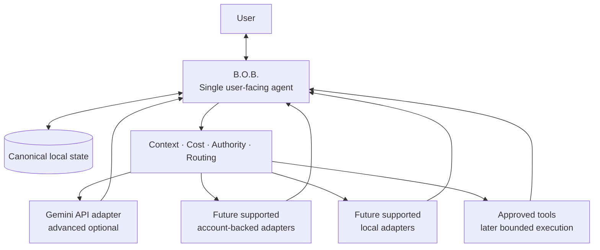
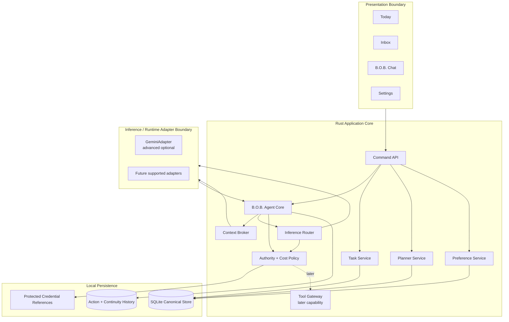
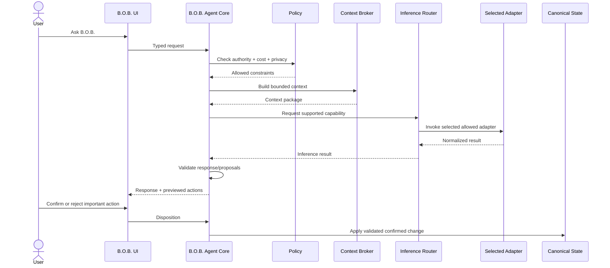

# Target Architecture

**Status:** Accepted  
**Related RFCs:** RFC-0001, RFC-0002, RFC-0003, RFC-0004  
**Related decisions:** ADR-0006

## Architectural objective

Build the smallest standalone desktop architecture that presents one coherent B.O.B. agent, safely owns local personal state, and can draw on multiple inference runtimes and tools over time without exposing backend complexity as the user's interaction model. Keep genuinely harness-neutral B.O.B. behavior portable behind B.O.B.-owned typed contracts so the desktop host is a first-party product surface rather than an accidental permanent container for every B.O.B. capability.

The current desktop architecture is a Tauri 2 shell with a Rust application core and a framework-free TypeScript + Vite frontend. Windows 11 x64 is the primary supported platform for the current runnable waypoint.

The first-alpha Gemini Developer API Free path proved the inference, credential, privacy, billing, and failure-policy seams. It remains an advanced optional adapter. Current Wayfinder direction is provider-independent: future account-backed and local paths must fit behind B.O.B.-owned routing, state, continuity, authority, and cost policy rather than redefining the application around any provider.

## Core invariant

> **B.O.B. is the agent. Models, inference runtimes, provider APIs/CLIs, harnesses, and tools are capabilities behind B.O.B.**

The user has one point of contact in the standalone product: B.O.B. Removing any single inference adapter must leave B.O.B. buildable, launchable, state-safe, and usefully deterministic.

ADR-0006 clarifies the deployment consequence: the standalone product invariant does not require harness-neutral B.O.B. capabilities to remain physically coupled to the Tauri desktop host. Another first-party host may run B.O.B.-owned portable semantics without becoming their owner or silently replacing B.O.B. state, policy, authority, continuity, or identity.

### B.O.T. anti-pattern

**B.O.T.** means **Bag of Tools**: an agent-like aggregation of models, tools, plugins, runtimes, or integrations without coherent ownership of identity, state, continuity, authority, policy, and user experience.

B.O.B. must not collapse into a B.O.T. A harness can offer many capabilities, but capability availability is not B.O.B. authority. If removing the installed tools/providers leaves no meaningful B.O.B. identity or deterministic behavior behind, the architecture has drifted into a B.O.T.

## Host portability boundary

B.O.B. uses a **portable capability core + first-party host adapters** architecture.

```text
                         B.O.B. portable core
                     planning · policy · proposals
                                ^
                                |
                 +--------------+--------------+
                 |                             |
          B.O.B. Desktop Host          B.O.B. DeepSeek Host
             Tauri + Rust                Cordis plugin edge
                 |                             |
          SQLite · keyring              bounded host protocol
                 |                             |
          inference/runtime port         bob-capability-host
                 |
        Gemini · Ollama · GG-CORE · other allowed runtime
```

Dependency rules:

- harness-neutral B.O.B. definitions do not depend on Tauri, DeepSeek Harness, QOR Agent, Cloudflare, GG-CORE, or a concrete inference provider;
- the desktop host and alternate-host adapters depend inward on B.O.B.-owned definitions;
- target-harness dependencies terminate inside their B.O.B.-owned adapter boundary;
- DeepSeek Harness is the first alternate first-party host: **B.O.B. is the agent; DeepSeek is the harness**;
- the first DeepSeek tracer is stateless and exposes one deterministic B.O.B. planning capability rather than copying B.O.B. rules into JavaScript;
- DeepSeek shell, filesystem, credential, job, subagent, and other tool authority is not imported into B.O.B. merely because the host exposes it;
- QOR Agent integration uses its public extension seams when a concrete use case warrants it; Cloudflare is one possible QOR host/proving surface, not the definition of the QOR Agent harness;
- GG-CORE sits below B.O.B.'s inference/runtime port and retains only its inference-execution responsibilities; B.O.B. retains state, authority, proposal, tool, privacy, and cost decisions;
- portability work for these integrations is implemented in this repository and does not require source changes in the target repositories.

The first alternate-host mode is stateless. A later stateful B.O.B. hosted mode requires an accepted contract for canonical owner, namespace, migration, synchronization, recovery, deletion/export, credential separation, and B.O.B. identity. A host harness session does not become B.O.B. canonical state by implication.

RFC-0004 is Accepted and defines the current portable-host contract. Issue #118 owns the first bounded DeepSeek host tracer.

## First portable implementation slice

The first implemented portable capability is deterministic remaining-work planning:

- `crates/bob-core` owns the narrow `PlanningRequest`, `PlanningItem`, `PlanProjection`, validation, and deterministic projection semantics;
- the request intentionally carries only `activeId`, `id`, `kind`, `priority`, `due`, and `status` because planning does not need titles, estimates, handoff text, credentials, persistence metadata, or host session transcripts;
- `src-tauri/src/planner.rs` maps canonical desktop state into that portable request while Tauri/SQLite orchestration remains in the desktop host;
- `crates/bob-capability-host` exposes protocol version 1 over newline-delimited stdio JSON and validates host input before invoking B.O.B. planning;
- `integrations/deepseek-harness` registers one bounded planning capability and invokes an explicit absolute B.O.B. host executable path with shell evaluation disabled.

The tracer intentionally compiles the same portable planning source into the desktop path without changing the already-locked Tauri dependency graph during alpha qualification. Packaging hardening may replace this source-module inclusion with a normal Cargo path/workspace dependency once that lockfile/workspace change can be validated as its own bounded slice.

## System context



B.O.B. is the product identity and system of record. Inference/runtime adapters provide replaceable capabilities.

## Logical architecture



## Layer responsibilities

### Presentation boundary

The frontend renders B.O.B. state and sends typed commands. It does not receive unrestricted filesystem, process, shell, database, or credential access.

Provider/runtime detail is exposed only when useful for explicit configuration, cost, privacy, capability, or troubleshooting. Ordinary interaction remains with B.O.B. Settings must not make provider plumbing the product identity.

### B.O.B. Agent Core

The B.O.B. Agent Core is the single user-facing orchestration boundary. The accepted #34 contract gives it responsibility for:

- conversational identity and response assembly;
- intent interpretation;
- bounded context assembly;
- inference routing and policy coordination;
- proposal validation;
- deterministic-service coordination;
- compact continuity and failure handling;
- result/evidence presentation.

It does not surrender canonical state ownership to an underlying runtime. Model/runtime output is untrusted until B.O.B. validates it. Important state-changing proposals are previewed before application.

### Deterministic application services

The Rust core owns deterministic business behavior, including item lifecycle, planning, persistence orchestration, export/migration, proposal validation, preference handling, and authority/cost enforcement. These services remain useful when no inference runtime is available.

ADR-0006 allows suitable deterministic services to move behind portable B.O.B.-owned contracts when a real second host requires them. The deterministic planner is the first such extracted semantic slice. Extraction does not change its semantics or transfer authority to the consuming harness.

### Inference router

The inference router selects only allowed capabilities according to supported configuration, explicit user choice where applicable, availability, auth state, billing classification, privacy constraints, and required capability.

Authentication method does not imply billing class. Unknown billing classification fails closed. Provider/model changes that materially affect cost, privacy, or user intent never happen silently.

The router must not become a speculative universal provider framework. Normalize only the fields and lifecycle behavior required by supported adapters.

### Inference/runtime adapters

Adapters normalize supported inference backends to narrow internal contracts. They do not become B.O.B.'s user-facing identity and do not own product state.

An adapter may report, where supported:

- availability;
- authentication state;
- runtime/model identity;
- capabilities;
- billing class;
- invocation status;
- structured result;
- cancellation.

Gemini Developer API is the currently implemented cloud adapter and remains subject to its accepted professional/business-use, unpaid-service data-use, secret, and billing boundaries. Account-backed and local adapters remain governed by Wayfinder #79 and must not be invented ahead of accepted authority.

GG-CORE, when integrated, implements this inference/runtime role through a supported B.O.B.-owned adapter. It does not become an application-state or tool-authority boundary.

### Tool gateway

Tools are separate capabilities from inference/runtime identity. Future Delegate behavior may add bounded execution authority through explicit user grants. Ordinary Assist requests do not inherit shell, filesystem, repository, or broad external permissions.

An alternate host exposing a B.O.B. capability does not receive Delegate authority merely because it can invoke that capability. Any executable authority crossing a host-adapter boundary requires its own accepted contract. The existence of host tools is not permission to turn B.O.B. into a B.O.T.

### Persistence

Persistence is local-first and single-user. The accepted contract is:

- one SQLite database owned exclusively by the Rust core as canonical ordinary application state;
- every logical state change commits transactionally or not at all;
- Rust owns immutable monotonic migrations and startup compatibility checks;
- schema-changing migrations create SQLite-consistent safety copies and fail closed on open/migration failure;
- B.O.B. retains bounded known-good recovery snapshots;
- ordinary crash consistency relies on SQLite rather than custom shadow-file logic;
- backup/restore uses SQLite-consistent snapshots with fail-closed rollback;
- portable export is a documented versioned JSON package of user-owned non-secret state;
- credentials remain in the OS secret store, with SQLite limited to non-secret references/status;
- corruption or migration failure never silently resets user data.

The SQLite schema owns ordinary product state, not an open-ended advanced memory subsystem. Richer governed-memory behavior should preferentially integrate later with `MythologIQ-Labs-LLC/agent-memory` through an explicit contract.

Stateless alternate-host capability use does not create another B.O.B. database. Stateful hosting is deferred until a separate accepted state-ownership contract exists.

See ADR-0004, ADR-0006, RFC-0003, and RFC-0004.

## Request flow



The user never changes conversational identity during this flow. Inference failure leaves deterministic B.O.B. behavior available.

## Canonical state boundary

```text
+------------------------------------------------------------------+
|                              B.O.B.                              |
|                                                                  |
|  Identity  Tasks  Plans  Inbox  Preferences  Working Continuity |
|      \       |      |      |        |             /             |
|       +------+------+-+----+--------+------------+              |
|                         |                                        |
|                  Canonical Local State                          |
|                         |                                        |
|             B.O.B. Context + Policy Boundary                    |
+-------------------------|----------------------------------------+
                          |
                selected capability, not identity
                          |
          +---------------+----------------+----------------+
          |                                |                |
   Gemini API adapter            Account-backed paths   Local paths
   advanced optional             when supported         when accepted
          |                                |                |
   non-canonical backend          non-canonical          non-canonical
```

## State domains

### Item

Minimum conceptual fields include `id`, `type`, `title`, `notes`, lifecycle `status`, `priority`, estimate, due time, optional energy, tags, and creation/update timestamps.

### DayPlan

A day plan owns its date, up to three default focus items, ordered blocks, optional day bounds/capacity, and enough generated/replanned metadata to explain the current plan.

### ConversationContinuity

B.O.B. stores compact continuity needed to preserve the one-agent experience across restart and runtime changes: conversation/thread identity, current intent, relevant work associations, compact summaries, runtime identity when useful, and returned proposals/outcomes. Vendor/runtime transcripts are not canonical state by default.

## Authority model

Authority belongs to B.O.B., not whichever runtime or host supplies surrounding capability. Assist may reason, summarize, organize, transform, and propose using an allowed adapter. Important state changes remain validated and previewed before application. Future Delegate behavior requires a separate bounded grant.

For an alternate host consuming a stateless B.O.B. capability, the host owns its surrounding session/lifecycle while B.O.B. capability code owns the semantics of its typed request/result boundary. Host authority is not imported into B.O.B. by default.

## Cost-policy boundary

Every inference/runtime adapter declares one billing class: `free`, `subscription`, `local`, `metered`, or `unknown`.

Unknown is blocked until classified. Metered inference is disabled by default and requires explicit user enablement. Authentication mechanism alone does not determine billing class.

The implemented Gemini API path is an advanced optional adapter with its own accepted provider-purpose/data-use and Free-Tier confirmation boundary. Future account-backed/local paths must preserve the same no-surprise-billing invariant.

See `docs/governance/AI_COST_AND_PROVIDER_POLICY.md`.

## Failure behavior

B.O.B. degrades safely:

- inference unavailable: deterministic B.O.B. remains operational;
- quota/auth/provider/network failure: no silent paid or different-provider fallback;
- invalid model proposal: reject without changing canonical state;
- persistence interruption: preserve user data and follow ADR-0004/RFC-0003 recovery semantics;
- runtime/provider failure: isolate failure from canonical state;
- alternate-host adapter failure: isolate the adapter from standalone B.O.B. state and fail through a bounded typed error;
- capability-host protocol mismatch or invalid input: fail closed without invoking the requested B.O.B. semantic operation;
- future tool failure: return evidence/status without widening authority.

## Technology boundaries

Current direction:

- Tauri 2 desktop shell as the current first-party standalone host;
- Rust privileged application core plus an implemented first portable planning slice under ADR-0006/RFC-0004;
- framework-free TypeScript + Vite frontend;
- Windows 11 x64 primary platform;
- one B.O.B. agent identity in the standalone product;
- Rust-owned SQLite canonical ordinary-state store;
- OS-backed secret-store boundary;
- provider-independent inference/runtime seams;
- Gemini Developer API as an advanced optional current adapter;
- a bounded DeepSeek Harness first-party host tracer under `integrations/deepseek-harness`;
- future additional first-party host adapters remain optional and live in this repository;
- no required local HTTP inference server, Python runtime, vector database, peer-agent UX, plugin marketplace, or mandatory provider/harness client;
- no direct UI access to native secrets, database, shell, or arbitrary filesystem;
- no competing advanced-memory subsystem inside ordinary SQLite state.

Future account-backed adapters, local inference, governed-memory integration, bounded tools, stateful hosted B.O.B., and additional host adapters may extend these seams only under accepted product/architecture authority. RFC-0004 governs the current portable-host boundary.
