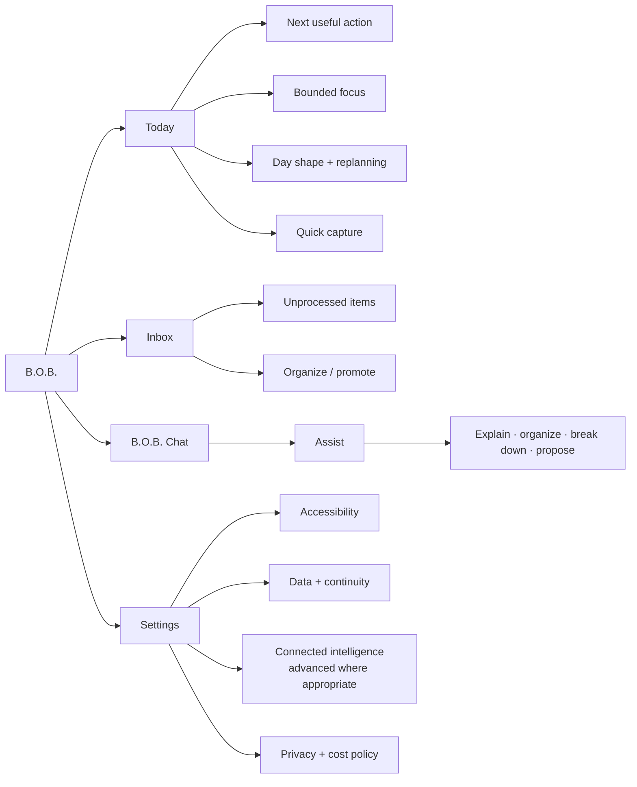
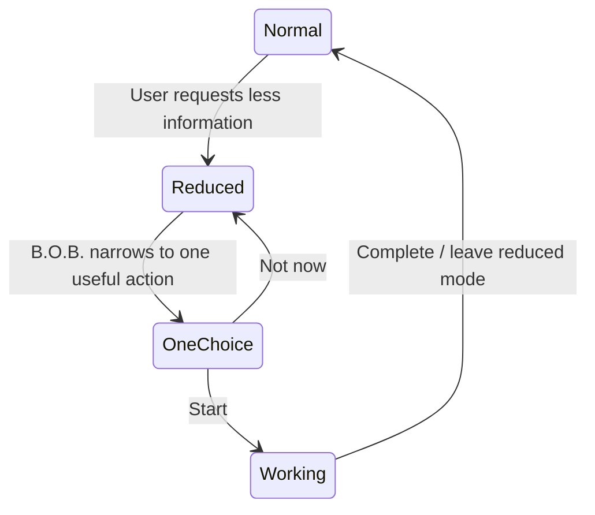
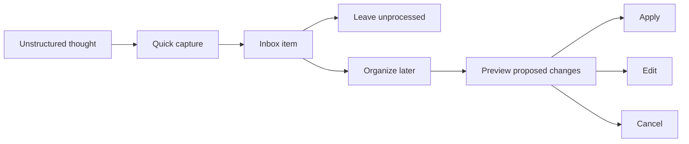
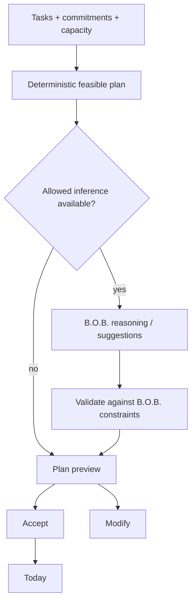

# Interaction and Information Design

**Status:** Accepted current interaction contract  
**Current convergence authority:** completed Wayfinder #86 and merged PRs #89, #93, and #106

## Design objective

B.O.B. should reduce the number of decisions required to begin useful work. The product should feel like one calm assistant with a durable workspace, not an analytics dashboard, provider switchboard, or blank chatbot.

> **Only the things that matter should compete for attention.**

The current normal-mode interaction model has already converged through rendered review. Future UI work should fix concrete defects or extend accepted product behavior rather than reopening the primary hierarchy by default.

## Information architecture

The top-level navigation intentionally stays small. New top-level surfaces require accepted product authority because every destination creates another place the user must remember to check.

## Global interaction rules

- B.O.B. is the user-facing identity. Provider/runtime names are secondary metadata or advanced configuration, not peer agents.
- One screen should have one dominant job.
- Progressive disclosure is preferred over persistent secondary chrome.
- Empty states should reclaim space rather than reserve large dead zones for absent content.
- Reduced-information mode is additive simplification, not a rescue mechanism for an overloaded default interface.
- Important state-changing proposals are previewed before application.
- Provider, privacy, billing, and locality information becomes prominent when it materially changes the user's decision.
- Unimplemented provider/runtime paths do not appear as fake controls.

## Today

Today is the default surface and should communicate B.O.B.'s purpose within seconds.

Normative hierarchy:

1. the next useful action or current work state;
2. a small realistic focus set;
3. the current day shape and replanning context;
4. immediate capture;
5. secondary controls and explanation.

Today should not become a full backlog dashboard. Counts, distant work, provider plumbing, and development status should not compete with the current action.

The landed Today convergence from issue #87 / PR #93 establishes the current normal-mode density and hierarchy. Future changes should preserve that hierarchy unless new product evidence justifies a different one.

## Reduced-information / overwhelmed mode

Reduced-information mode removes cognitive load from the current surface.

It should hide nonessential counts, distant backlog, optional detail, and secondary controls. It must not become a separate workflow with its own maintenance burden.

## Capture and Inbox

Capture must be cheaper than organization.

A user must not have to decide priority, category, duration, project, tags, and due date before saving a thought.

The landed Inbox convergence from issue #88 / PR #106 establishes a compact recoverable queue with clear attention hierarchy. Inbox should feel like a safe holding place, not a wall of administrative debt.

## Planning and replanning

Planning combines deterministic scheduling with optional inference.

Deterministic inputs include fixed commitments, available day window, estimates, due constraints, selected focus, and completed work. Inference may help select, sequence, explain, or break down work, but B.O.B. validates proposals against deterministic state and time constraints.

Replanning should be cheap enough to use after ordinary disruption. It preserves completed work and fixed commitments, recalculates remaining capacity, and moves or defers flexible work without framing disruption as failure.

## B.O.B. Chat

Chat is a workspace connected to current B.O.B. state, not a provider session selector.

Normal Chat behavior may:

- explain the current plan or state;
- organize captured material;
- break work into smaller steps;
- reorient after interruption;
- facilitate a bounded decision;
- propose priorities or state changes;
- preserve compact resume/handoff continuity;
- use an allowed inference runtime without changing the B.O.B. conversational identity.

Provider/runtime identity may be inspectable when useful, but ordinary Chat should not present controls such as `Agent: Claude Code` or a roster of models as the primary interaction model.

The landed Chat convergence from PR #106 establishes the current conversation-workspace density and relationship to the rest of the product.

## Settings

Settings exposes configuration that has a real user job:

- accessibility and information-density preferences;
- local data, export, backup, and continuity information;
- truthful connected-intelligence availability/configuration;
- provider-specific setup only where an adapter actually exists;
- privacy, locality, billing-class, and cost controls where relevant.

The landed Settings convergence from PR #89 deliberately removed persistent provider-specific status from ordinary product chrome and demoted Gemini API setup to an advanced optional capability.

Settings must not expose development governance, alpha-boundary explanations, unresolved provider ideas, or fake future adapters as ordinary user configuration.

## Recovery surface

When canonical state cannot be opened safely, B.O.B. may enter a restricted recovery-only surface before ordinary commands run.

Recovery interaction requirements:

- clearly state that normal work is temporarily unavailable without implying data loss;
- preserve the original/corrupt canonical state rather than silently resetting it;
- show only B.O.B.-managed recovery candidates from the accepted bounded location;
- disclose when only the newest bounded candidate set is displayed;
- allow a candidate to be checked through the governed preview path before any later restore action;
- present failed/unavailable previews without stranding the user;
- provide a real retry/restart path;
- maintain keyboard focus, readable hierarchy, larger-text behavior, reduced-motion compatibility, and minimum-window usability.

Hosted rendered recovery fixtures are presentation evidence only. Native Windows/Tauri recovery acceptance remains required under issue #85 / draft PR #103.

## Assist and future Delegate

**Assist** is the current normal authority mode. It may reason, organize, transform, explain, and propose without inheriting shell, filesystem, repository, credential, or external-workspace authority.

**Delegate** is a later bounded execution capability. When implemented, delegation must identify the task/capability grant, workspace or resource boundary where relevant, expected cost/privacy class, lifecycle/cancellation behavior, and evidence/result surface. The user delegates to B.O.B., not to a peer agent.

Delegate is not part of the current first-alpha acceptance requirement and should not be displayed as if already available.

## Cost and provider visibility

The UI should distinguish supported runtime paths when billing, locality, privacy, capability, or troubleshooting makes the distinction relevant.

Billing classes are `free`, `subscription`, `local`, `metered`, and `unknown`. `unknown` fails closed. Metered use requires deliberate enablement. Provider/model changes that materially affect cost, privacy, locality, or user intent must never be silent.

The ordinary product identity remains B.O.B.; provider plumbing is progressive detail.

## Accessibility requirements

Accessibility and low cognitive load are product requirements. The current product should preserve:

- keyboard navigation and visible focus;
- sufficient contrast;
- reduced motion;
- scalable/larger text;
- semantic labels and screen-reader-compatible controls where applicable;
- no critical state conveyed only by color;
- user-controllable information density;
- readable hierarchy at the supported minimum window size.

Hosted rendered diagnostics provide bounded regression evidence for these states. Native evidence is still required where the Tauri/Windows boundary materially affects behavior.

## UX anti-patterns

Avoid:

- empty-chat-first startup;
- giant dashboards of completion percentages;
- punitive overdue styling;
- forced categorization at capture time;
- visible peer-agent/provider rosters as the normal interaction model;
- automatic provider/model switching without materially necessary disclosure;
- hidden destructive or billable actions;
- modal chains for routine task updates;
- persistent development/governance exposition in user-facing Settings;
- surfacing every experimental feature as navigation;
- reopening already-converged primary hierarchy without concrete evidence of a defect.

## Historical visual material

Generated pre-alpha concepts in [`inspiration/`](inspiration/README.md) and the prototype brief in [`pre-alpha/`](pre-alpha/) are preserved for provenance. They are not current normative specifications. When they conflict with this document, accepted Wayfinder decisions, or the landed product, current authority wins.
