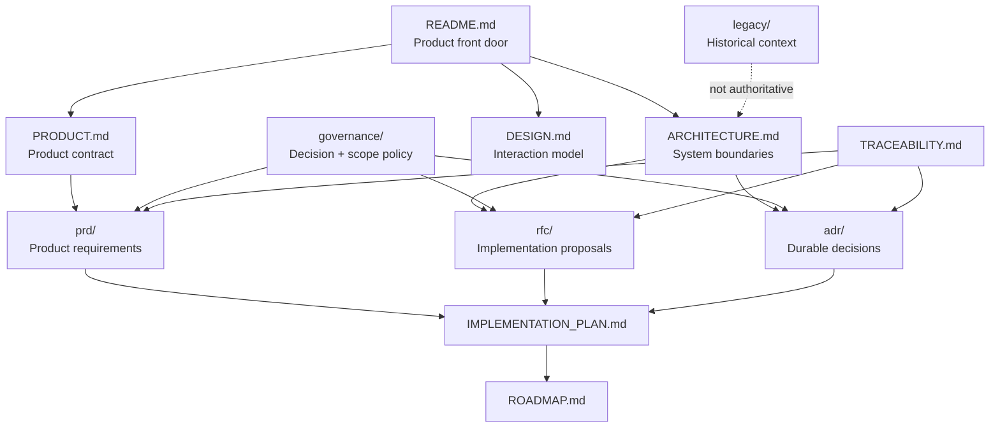
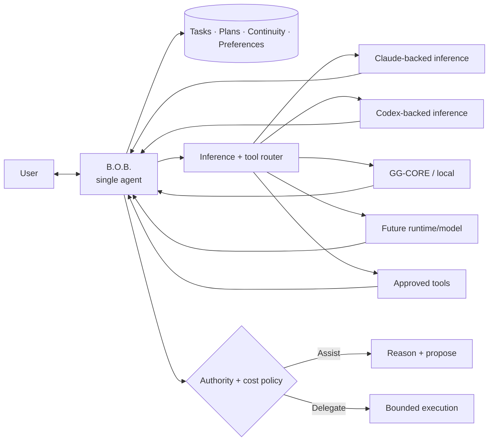

# B.O.B. Documentation

This directory is the authoritative design and decision surface for Better Organized Brain.

The root [`README.md`](../README.md) is the product front door. This index answers the next question: **where is the governing detail for the thing I am about to change?**

## Documentation topology

## Start by intent

| You need to... | Read |
| --- | --- |
| Understand why B.O.B. exists and what it owns | [`PRODUCT.md`](PRODUCT.md) |
| Understand the single-agent architecture, state ownership, inference routing, trust boundaries, and data flow | [`ARCHITECTURE.md`](ARCHITECTURE.md) |
| Understand portable B.O.B. capabilities and first-party external-harness adapters | [`adr/ADR-0006-portable-capabilities-and-host-adapters.md`](adr/ADR-0006-portable-capabilities-and-host-adapters.md) and [`rfc/RFC-0004-portable-capability-host-contract.md`](rfc/RFC-0004-portable-capability-host-contract.md) |
| Understand Today, Inbox, Chat, accessibility, overwhelm reduction, and interaction rules | [`DESIGN.md`](DESIGN.md) |
| Understand implementation order and acceptance gates | [`IMPLEMENTATION_PLAN.md`](IMPLEMENTATION_PLAN.md) |
| Understand release sequencing | [`ROADMAP.md`](ROADMAP.md) |
| Trace requirements to decisions and planned implementation | [`TRACEABILITY.md`](TRACEABILITY.md) |
| Propose or review user-facing requirements | [`prd/`](prd/) |
| Propose or review a significant implementation mechanism | [`rfc/`](rfc/) |
| Propose or review a durable architectural choice | [`adr/`](adr/) |
| Understand decision authority, scope, documentation, and AI-cost policy | [`governance/`](governance/) |
| Understand what was retired from the original prototype | [`legacy/`](legacy/) |
| Review active project history | [`CHANGELOG.md`](CHANGELOG.md) |

## Authority order

When documents appear to disagree, do not guess. Resolve the conflict using this order:

1. explicit repository-owner direction recorded in the current governing change;
2. accepted ADRs and PRDs;
3. accepted RFCs;
4. current product and architecture documents;
5. implementation plans and roadmap;
6. historical material.

A `Proposed` record is a proposal, not a loophole for implementation to choose its favorite answer. Resolve material uncertainty before building on it.

## Product contract at a glance

The invariant is simple:

> **B.O.B. is the agent. Models, inference runtimes, provider CLIs, and tools are capabilities behind B.O.B.**

The user gets one identity, one continuity layer, and one place where only relevant complexity should become visible. ADR-0006 additionally permits harness-neutral B.O.B. capabilities to be consumed through first-party host adapters without transferring standalone B.O.B. state or product identity to the host by implication.

## Documentation quality bar

Documentation must be:

- **truthful:** describe what exists, distinguish target from implemented state, and avoid aspirational capability claims;
- **bounded:** state ownership, authority, cost, failure modes, and non-goals explicitly;
- **traceable:** material behavior should lead back to a PRD, RFC, ADR, or a documented reason why one is unnecessary;
- **visual when structure matters:** architecture, state transitions, routing, authority, and user flows should use Mermaid or concise ASCII diagrams when a diagram communicates better than paragraphs;
- **navigable:** a reader should know where to go next without searching the entire repository;
- **maintained with code:** stale documentation is a defect, not harmless prose.

Detailed requirements are in [`governance/DOCUMENTATION_STANDARD.md`](governance/DOCUMENTATION_STANDARD.md).

## Current implementation status

B.O.B. is public, MIT licensed, and in active pre-alpha development on the revived Tauri 2 + Rust architecture. The active tree now contains Rust-owned local state, Today/Inbox workflows, deterministic planning, B.O.B. Assist/proposal boundaries, recovery/export foundations, accessibility preferences, provider-independent runtime policy, and an advanced optional Gemini API capability.

The remaining current work is primarily executable/readiness and rendered-product convergence: native Windows recovery/credential/package exercises, exact-head validation, rendered accessibility/UX evidence, and provider-independent runtime proving. Use [`IMPLEMENTATION_PLAN.md`](IMPLEMENTATION_PLAN.md), the active Wayfinder maps, and current issues/PRs for the live frontier.

Repository CI is intentionally minimal. [`AGENTS.md`](../AGENTS.md) makes the implementing developer or coding agent responsible for relevant validation and explicit evidence in each pull request.

## Historical material

Do not copy architecture from old source paths because they look more concrete than the design documents. The original prototype included useful ideas alongside abandoned experiments, duplicate runtimes, an AI HTTP server, Ollama assumptions, RAG infrastructure, checked-in model artifacts, and cognitive-profile concepts that are not part of the revived product contract.

Historical implementation remains visible in older Git history and the named archive branch. It is evidence, not authority.

See [`legacy/README.md`](legacy/README.md) for preservation details.
