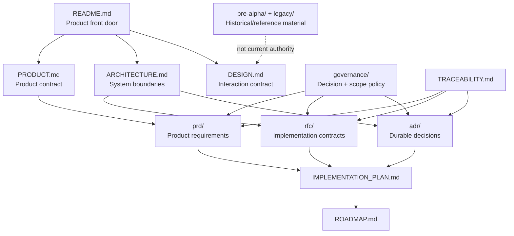
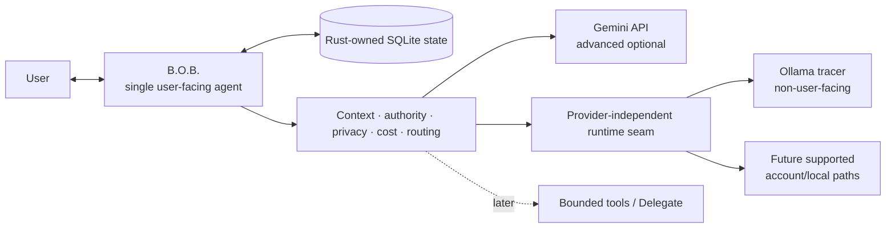

# B.O.B. Documentation

This directory is the authoritative design and decision surface for Better Organized Brain.

The root [`README.md`](../README.md) is the product front door. This index answers the next question: **where is the governing detail for the thing I am about to change?**

## Documentation topology

## Start by intent

| You need to... | Read |
| --- | --- |
| Understand why B.O.B. exists and what it owns | [`PRODUCT.md`](PRODUCT.md) |
| Understand the single-agent architecture, state ownership, inference routing, trust boundaries, and data flow | [`ARCHITECTURE.md`](ARCHITECTURE.md) |
| Understand the current Today, Inbox, Chat, Settings, accessibility, and low-cognitive-load interaction contract | [`DESIGN.md`](DESIGN.md) |
| Understand portable B.O.B. capabilities and future first-party host adapters | [`adr/ADR-0006-portable-capabilities-and-host-adapters.md`](adr/ADR-0006-portable-capabilities-and-host-adapters.md) and Proposed [`rfc/RFC-0004-portable-capability-host-contract.md`](rfc/RFC-0004-portable-capability-host-contract.md) |
| Understand implementation order and current acceptance gates | [`IMPLEMENTATION_PLAN.md`](IMPLEMENTATION_PLAN.md) |
| Understand release sequencing | [`ROADMAP.md`](ROADMAP.md) |
| Understand native/product validation requirements | [`VALIDATION.md`](VALIDATION.md) |
| Trace requirements to decisions and implementation authority | [`TRACEABILITY.md`](TRACEABILITY.md) |
| Propose or review user-facing requirements | [`prd/`](prd/) |
| Propose or review a significant implementation mechanism | [`rfc/`](rfc/) |
| Review durable architectural decisions | [`adr/`](adr/) |
| Understand decision authority, scope, documentation, and AI-cost policy | [`governance/`](governance/) |
| Understand the retired prototype | [`legacy/`](legacy/) |
| Understand pre-alpha visual/prototype history | [`pre-alpha/`](pre-alpha/) and [`inspiration/`](inspiration/) |
| Review active project history | [`CHANGELOG.md`](CHANGELOG.md) |

## Authority order

When documents appear to disagree, do not guess. Resolve the conflict using this order:

1. explicit repository-owner direction recorded in the current governing change;
2. accepted ADRs and PRDs;
3. accepted RFCs;
4. current product and architecture documents;
5. implementation plan and roadmap;
6. historical/reference material.

A `Proposed` record is a proposal, not implementation authority. A `Rejected`, `Superseded`, or historical record remains useful for provenance but must not compete with current authority.

## Product contract at a glance

The invariant is simple:

> **B.O.B. is the agent. Models, inference runtimes, provider APIs/CLIs, and tools are capabilities behind B.O.B.**

The user gets one identity, one continuity layer, and one place where only relevant complexity should become visible. ADR-0006 permits genuinely harness-neutral B.O.B. capabilities to be consumed through first-party host adapters without transferring standalone B.O.B. state or product identity to the host by implication.

## Current implementation status

B.O.B. is public, MIT licensed, and in active **pre-alpha** development. It is no longer a planning-only revival: the active tree contains the Tauri 2 + Rust desktop application, Rust-owned SQLite state/migrations/backup/restore/export, Today/Inbox/Chat/Settings, deterministic planning and task lifecycle behavior, B.O.B. Assist/proposal validation, preview-before-apply, accessibility preferences, protected credentials, provider-independent runtime policy, an advanced optional Gemini API adapter, a bounded Ollama tracer, reproducible Windows packaging, and hosted rendered diagnostics.

The calm primary-workflow frontier is complete. Provider-independence research for the current runtime contract and local-runtime direction is also resolved enough to build under accepted authority. The immediate first-alpha frontier is now narrower:

1. native Windows 11 x64 startup-recovery acceptance under #85 / draft PR #103;
2. native Windows 11 x64 NSIS install/relaunch/uninstall acceptance under #84 / draft PR #115;
3. a fresh alpha convergence audit under Wayfinder #30;
4. only then promotion of one already-authorized inference path with native evidence.

The `pre-alpha` label remains intentional until those first-alpha acceptance obligations are truthfully closed. Passing hosted CI alone does not satisfy them.

## Documentation quality bar

Documentation must be:

- **truthful:** describe what exists, distinguish target from implemented state, and avoid aspirational capability claims;
- **bounded:** state ownership, authority, cost, failure modes, and non-goals explicitly;
- **traceable:** material behavior should lead back to a PRD, RFC, ADR, Wayfinder decision, or a documented reason why one is unnecessary;
- **visual when structure matters:** architecture, state transitions, routing, authority, and user flows should use Mermaid or concise ASCII when a diagram communicates better than paragraphs;
- **navigable:** a reader should know where to go next without searching the entire repository;
- **maintained with code:** stale documentation is a defect, not harmless prose.

Detailed requirements are in [`governance/DOCUMENTATION_STANDARD.md`](governance/DOCUMENTATION_STANDARD.md).

## Historical material

The original prototype and early revival design artifacts remain available for provenance. They are intentionally non-authoritative when they conflict with accepted product/design decisions or current implementation truth.

The retired Electron/Ollama/RAG-era implementation is preserved in Git history and `archive/pre-revival-cleanup-2026-08-19`; see [`legacy/README.md`](legacy/README.md).

The pre-alpha prototype brief and generated inspiration artifacts record how the current interaction model was explored. They no longer govern the landed production-oriented desktop implementation; see [`pre-alpha/PRE_ALPHA_UI_BRIEF.md`](pre-alpha/PRE_ALPHA_UI_BRIEF.md) and [`inspiration/README.md`](inspiration/README.md).
