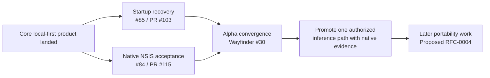

# Requirements and Decision Traceability

This document maps current product promises to governing records and implementation/readiness authority.

| Product concern | PRD | RFC | ADR / governing policy | Current implementation / readiness authority |
| --- | --- | --- | --- | --- |
| Single B.O.B. identity across inference capabilities | PRD-0001 | RFC-0002 | ADR-0001 | `PRODUCT.md`, `ARCHITECTURE.md`, Wayfinder #79 |
| ADHD-friendly planning and low cognitive load | PRD-0002 | RFC-0003 | ADR-0004 | `DESIGN.md`, completed Wayfinder #86, PRs #89/#93/#106 |
| Provider-independent inference and no-surprise cost | PRD-0003 | RFC-0002 | `governance/AI_COST_AND_PROVIDER_POLICY.md`; ADR-0003 is rejected history | Wayfinder #79, #80, #81; runtime policy + Ollama tracer on `master` |
| Desktop runtime and privileged boundary | PRD-0001 | RFC-0001 | ADR-0002 | `ARCHITECTURE.md`, Windows 11 x64 first |
| Canonical local state, migration, backup/restore/export | PRD-0001, PRD-0002 | RFC-0003 | ADR-0004 | `ARCHITECTURE.md`, issue #85 / draft PR #103 for startup recovery acceptance |
| B.O.B. Assist vs bounded future Delegate authority | PRD-0001 | RFC-0002 | ADR-0005 | `PRODUCT.md`, `ARCHITECTURE.md`, `.github/SECURITY.md` |
| Runtime identity/auth/billing/locality contract | PRD-0001, PRD-0003 | RFC-0002 | ADR-0001; cost/provider policy | Wayfinder #79; Rust runtime policy on `master` |
| Optional local inference | PRD-0003 | RFC-0002 | provider policy | #81 accepted `LocalRuntimeAdapter` direction; user-facing promotion remains post-readiness |
| Calm Today / Inbox / Chat / Settings hierarchy | PRD-0002 | — | accepted design + Wayfinder authority | completed #86; merged #89/#93/#106 |
| First-alpha validation and packaging | PRD-0001, PRD-0002, PRD-0003 as applicable | RFC-0001, RFC-0003 | `VALIDATION.md` / Wayfinder #39 | issue #84 + draft PR #115; Wayfinder #30 convergence |
| Fail-closed startup recovery | PRD-0001, PRD-0002 | RFC-0003 | ADR-0004 | issue #85 / draft PR #103; native Windows acceptance outstanding |
| Portable B.O.B. capability core + first-party host adapters | PRD-0001 | RFC-0004 **Proposed** | ADR-0006 | design-intent #109 complete; implementation waits until alpha stabilization/convergence |

## Governing invariant

> **B.O.B. is the user-facing agent and canonical state owner. Models, inference runtimes, provider APIs/CLIs, and tools are replaceable capabilities behind B.O.B., not peer agents.**

Implementation may support multiple backends without exposing a multi-agent product model or transferring state/authority to a provider runtime.

## Current first-alpha trace

The first runnable alpha is not established by merged-PR count or hosted CI. The native acceptance and convergence obligations above must be truthfully dispositioned.

## Implementation traceability

Material pull requests should identify the governing records they satisfy. Acceptance criteria should become tests or explicit manual/native evidence where automation is not practical.

If code cannot be traced to accepted authority and meaningfully expands behavior, stop and determine whether the requirement is missing or the code is out of scope. Historical, rejected, or proposed documents do not become implementation authority merely because they are more convenient than the current governing record.
